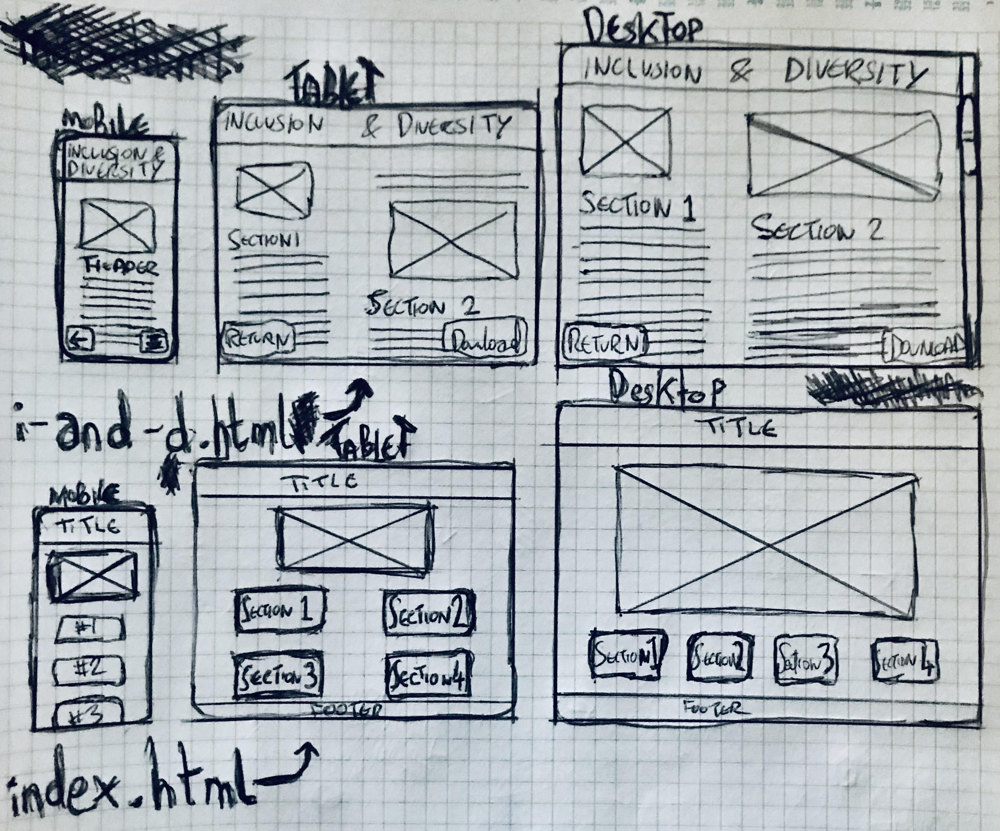

# Inclusivity in a Diverse Workspace

**Link:** 
## Purpose
To introduce diversity and inclusion concepts to employees of a workplace, and offers basic guidance on how to implement these practices.
## Target Audience
Employees of a workspace.
## User Stories
- **Jen Barber, Relationship Management:** The user wants to gain a basic understanding of diversity and inclusion in the workplace or educational environment, so that they can apply those strategies to their team leadership. They seek straightforward information and tips presented in a clear, organised format.
> A landing page comprised of a concise and apparent navigation to the document on company policy creates an unintimidating path to the precise information sought after.

- **Denholm Reynholm, Policy Manager for Company:** The site's content is easy to update with new policy or alterations to previous policy as values and practices develop.
> Having a DOM where all policy is within one, sectioned HTML file makes it easy for the Policy Manager to, with the site owner's graces, edit this document, and replace it with ease. Effective use of comments throughout the i-and-d.html file also facilitate this nature of use.

## Wireframes

## Accessibility Considerations
i-and-d.html document has been coded into sections, and as one complete article using semantical html. Furthermore, a 'Download' button floats above this article on the i-and-d.html enabling Users to access a .pdf version of the document.
index.html features a large navigation centre, enabling Users to quickly access the most relevant sections of i-and-d.html.
### Core Features (Must-Haves)
- **Policies Article:** A description of the policies Reynholm Industries wishes to promote.
- **Navigation:** A set of buttons, enabling User's to navigate directly to whichever section of the i-and-d.html document they require.
### Advanced Features (Could-Haves)
- **Document Navigation:** A collapsible, simpler version of the navigation feature, available on the i-and-d.html document itself
- **Form:** A separate page that enables Users to submit enquiries, or complaints, about the document's content.
## Deployment Process
*Briefly describe the deployment process to GitHub Pages or another cloud platform.*  
*Mention any specific challenges encountered during deployment.*  
### Testing Results
*Summarize the results of testing with Chrome Dev Tools, with different devices and screen sizes.*  
*Mention any issues found and how they were resolved.*  
### Validation
*Discuss the validation process for HTML and CSS using W3C and Jigsaw validators.*  
*Include the results of the validation process.*  
***Guidance:** Document your use of W3C and Jigsaw validators to ensure your HTML and CSS meet web standards. Include any errors or warnings encountered and how they were resolved.*
## Image Assets Sourced:
https://theitcrowd.fandom.com/wiki/Reynholm_Industries?file=Reynholmlogo.png
https://pixabay.com/illustrations/portrait-man-office-worker-8694041/